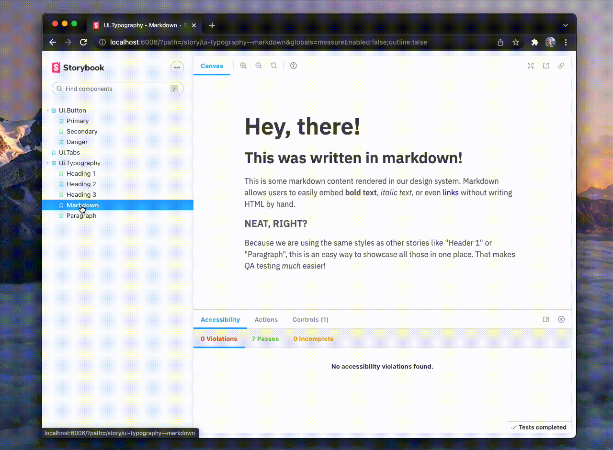

# @ryannhg/elm-storybook
> Build your next design system with [Elm](https://elm-lang.org) and [Storybook](https://storybook.js.org)!



## Live demo

Check out [elm-storybook.rhg.dev](https://elm-storybook.rhg.dev/) to see Elm and Storybook in action!

## Local development

If you have the latest version of [Node.js](https://nodejs.org) installed, this repo is ready to run on your own machine:

```bash
# Get the code...
git clone https://github.com/ryannhg/elm-storybook
cd elm-storybook

# and run it with node!
npm install
npm run storybook
```

## "What is it for?"

[Storybook](https://storybook.js.org) describes itself as "_an open source tool for building UI components and pages in isolation_". It's a popular tool for creating __design systems__ in your favorite language/framework.

This repo is an example of how to use Storybook with [Elm](https://elm-lang.org). Elm is a delightful language for building reliable web apps. It doesn't throw any runtime errors in the browser, and it has __really friendly__ compiler messages as you code.

By powering our Elm/Storybook app with [Vite](https://vitejs.dev), we're able to iterate on our Elm components, and combine Elm's lightning-fast compiler with Vite's lightning-fast dev server. This means instant style changes, in-browser error messages, and an overall good time. 😎

## "What can I do with it?"

Storybook has a lot of great plugins that make working with a design/product team feel awesome. This repo has examples of how you can leverage many of those features in Elm:

### ❤️ __Accessibility__
Make your UI more user-friendly for everyone, by getting things like color-contrast warnings or invalid HTML in the "Accessibility" tab.

### 🪵 __Actions__ 
Log component events as messages in the "Actions" tab, so you can see how your components respond to user interaction codebase.

### 🎛 __Controls__
Easily see how a component performs with different size labels, color variations, and more using the "Controls" tab. Does our paragraph wrap correctly? Does it unexpectedly clip off its content?

### 👩‍💻 __Source__
See the Elm source code directly in the browser, using the "Source" tab! This makes it easy to see example usage and copy snippets into your project.


## "How do I use it?"

Check out the [docs folder](./docs/README.md) to see guides on getting started and deploying to production!

## Disclaimer

I chose to make this code/documentation publically available because I'm a huge fan of [Storybook](https://storybook.js.org), [Vite](https://vitejs.dev) and [Elm](https://elm-lang.org)! They are awesome open-source tools, so I spent a bunch of my personal time getting them to work together. 

My goal for this project is to share this resource with anyone trying to build cool stuff!

I'm happy to share this work with the Open Source Software community– but have no plans to create an official package or maintain this for anyone or their company's needs. With all that out of the way, I hope you benefit from this codebase, and feel empowered to share all the __great things__ you make! 🎉
