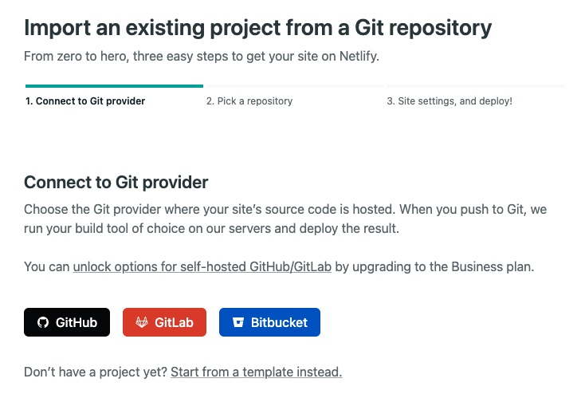
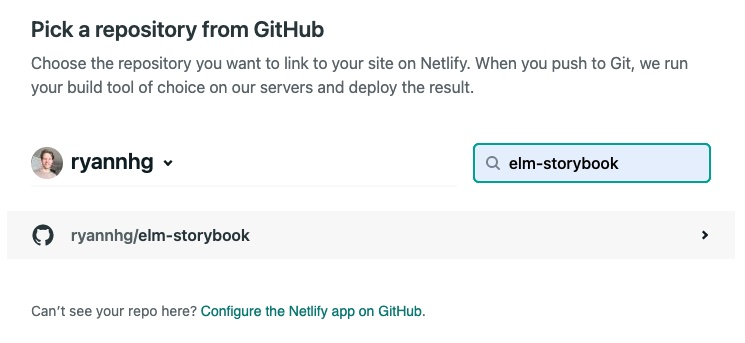
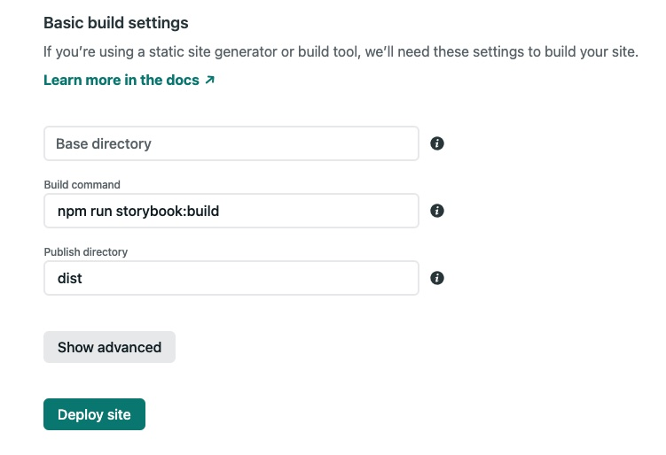

# Documentation
> Here's how to use Elm with Storybook for your next project!

## Guides

1. [Starting from scratch](#starting-from-scratch)

1. [Adding Storybook to an existing Elm project](#adding-storybook-to-an-existing-elm-project)

1. [Deploying to production](#deploying-to-production)


# Starting from scratch

Starting a new Elm/Storybook project will require [Node.js](https://nodejs.org). At the time of writing, we are using Node.js `v16.13.0`, but any supported LTS version 16+ should work.

( You can check your installed version by running `node -v` from the terminal )


### Steps

1. [Create a new Elm project](#1-create-a-new-elm-project)

1. [Create a Ui.Button component](#2-create-a-uibutton-component)

1. Continue to [adding Storybook to an existing Elm project](#adding-storybook-to-an-existing-elm-project)


## 1. Create a new Elm project

Using `npx`, we can easily create a blank Elm project:

```bash
mkdir your-project
cd your-project

npx elm init
```

✅  __Did it work?__ You should see an `elm.json` file, and an empty `src` folder.

## 2. Create a Ui.Button component

For this guide, we are going to create our first UI component at `./src/Ui/Button.elm`:

```elm
module Ui.Button exposing (view)

import Html exposing (Html)
import Html.Events


view : { label : String, onClick : msg } -> Html msg
view options =
    Html.button
        [ Html.Events.onClick options.onClick ]
        [ Html.text options.label ]
```

✅  __Did it work?__ Test your code by running `npx elm make src/Ui/Button.elm`... If you see a success message and a generated `index.html` file, you did it! (🧹 Feel free to delete that `index.html` file)


That's it for "Starting from Scratch", please proceed to the next guide to see how to set up Storybook with your new Elm project!


# Adding Storybook to an existing Elm project

### Steps

1. [Create a new package.json](#1-create-a-new-packagejson)

1. [Install the NPM dependencies](#2-install-the-npm-dependencies)

1. [Grab the .storybook folder](#3-grab-the-storybook-folder)

1. [Add the Storybook scripts](#4-add-the-storybook-scripts)

1. [Add your first story](#5-add-your-first-story)

### Assumptions

This guide will assume you have a standard Elm project folder structure like this one:

```bash
your-project/
  |- src/
  |   |- Main.elm   # Your Elm application entrypoint
  |   |- ...
  |   |- Ui               # An example of a UI component you might
  |       |- Button.elm   # want to see in Storybook
  |       |- ...
  |- elm.json
```

## 1. Create a new package.json

Because Storybook is installed through NPM, you'll want to create a new `package.json` to track your node dependencies.

```bash
cd your-project

# Create `package.json` (if it doesn't already exist)
npm init -y
```

✅  __Did it work?:__ A new `package.json` should now exist alongside `elm.json`, in your project's root folder.

## 2. Install the NPM dependencies

Once you have a `package.json`, you'll want to install these packages using NPM:

```bash
npm install --save-dev --save-exact \
    @babel/core@7.17.5 \
    @storybook/addon-a11y@6.4.19 \
    @storybook/addon-actions@6.5.0-alpha.47 \
    @storybook/addon-essentials@6.5.0-alpha.47 \
    @storybook/html@6.5.0-alpha.47 \
    babel-loader@8.2.3 \
    elm@0.19.1-5 \
    storybook-builder-vite@0.1.18 \
    vite@2.8.6 \
    vite-plugin-elm@2.5.1
```

✅  __Did it work?:__ You should now see those NPM packages listed in the `dev-dependencies` section of your `package.json` file.


## 3. Grab the `.storybook` folder

On this repo, there is [a `.storybook` folder](https://github.com/ryannhg/elm-storybook/tree/main/.storybook) with a few files needed to create Elm components in Storybook, helpful addons, and handle configuration boilerplate.

The easiest way to get these files is to run this command at the root of your project:

```bash
# Downloads the .storybook folder from this GitHub repo
# into to a local ".storybook" folder.

npx degit ryannhg/elm-storybook/.storybook .storybook
```

✅  __Did it work?__ You should now see a `.storybook` folder alongside your `src`. (You may need to run `ls -a` to see folders starting with `.`)


## 4. Add the Storybook scripts

To run Storybook from the command line, add these two scripts to your `package.json` file, in the scripts section:

```jsonc
// package.json
{
  ...,
  "scripts": {
    "storybook": "start-storybook -p 6006",
    "storybook:build": "build-storybook -o dist"
  },
  ...
}
```

Command | Description
:-- | :--
`npm run storybook` | Runs your Storybook server at http://localhost:6006
`npm run storybook:build` | Builds your Storybook app, useful when [Deploying to Netlify](#deploying-to-netlify).

✅  __Did it work?__ Try running `npm run storybook`, then visiting http://localhost:6006 in your web browser.


## 5. Add your first story

Now that Storybook is running in the browser, you will be able to add your first story! Each story you create will have a corresponding `.stories.js` and `.elm` file.

Create a new folder at `src/Stories`, and let's add a story for that `Ui.Button` component:

### `src/Stories/Button.elm`

```elm
module Stories.Button exposing (main)

import Html exposing (Html)
import Storybook.Component exposing (Component)
import Storybook.Controls
import Ui.Button


main : Component () Msg
main =
    Storybook.Component.stateless
        { controls = Storybook.Controls.none
        , view = view
        }


type Msg
    = UserClickedButton


view : () -> Html Msg
view controls =
    Ui.Button.view
        { label = "Click me!"
        , onClick = UserClickedButton
        }
```

### `src/Stories/Button.stories.js`

```js
import { Elm } from './Button.elm'
import elmSource from './Button.elm?raw'
import { ElmComponent } from 'elm-storybook'

export default {
  title: 'Button',
  parameters: { elmSource },
  argTypes: {
    onAction: { action: 'Elm' }
  }
}

export const Button = (controls) =>
  ElmComponent.create(Elm.Stories.Button, controls)
```

✅  __Did it work?__ Refresh Storybook at http://localhost:6006 in your web browser. You should now see a __"Button"__ story appear on the sidebar! 

Take a look at the addons panel (press `A` in Storybook to toggle visibility):
- The __Actions__ tab will show logged messages each time your button is clicked
- The __Source__ tab will show you the Elm story


## That's it for now! 

Here's a breakdown of what your directory structure should look like:

```bash
your-project/
  |- .storybook/  # Storybook configuration folder
  |- src/
      |- Stories/   # Where you'll write stories
          |- Button.elm
          |- Button.stories.js
      |- Ui/
          |- Button.elm  # Example component file
      |- ...
  |- elm.json
  |- package.json
  |- ...
```

To see more examples on how to add __controls__, work with __stateful UI__, and more– check out [the src/Stories folder](../src/Stories/) for this repo. It has a few examples to get you inspired!


# Deploying to production

Although Storybook can be deployed on any platform, this guide will show you how you can deploy your design system for free using __Netlify__. (That's where http://elm-storybook.rhg.dev is hosted!)

This guide assumes your `package.json` has the `storybook:build` script shown in the previous guides:

```jsonc
// package.json
{
  ...,
  "scripts": {
    ...,
    "storybook:build": "build-storybook -o dist"
  },
  ...
}
```

1. Push your project to a GitHub repo (can be private or public!)

1. Sign in to Netlify and visit [this page to create an app](https://app.netlify.com/start)

1. Select __GitHub__ project:
    <div></img></div>

1. Search for your new project:
    <div></img></div>

1. Set the "Build command" to `npm run storybook:build`, and the "Publish directory" to `dist`, as shown below:
    <div></img></div>

1. Click "Deploy site"!

That's it! your new Storybook app will deploy shortly and be available to share. As you push to the GitHub repo, Netlify will __automatically__ detect the changes and redeploy them for you 🪄
